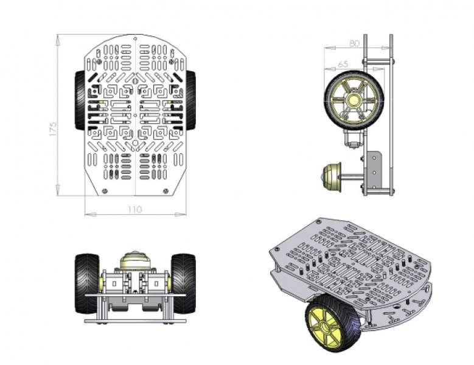

# my_robot_description package

### xacro

To convert the xacro file into a URDF file:
```bash
$ roscd my_robot_description/urdf/
$ rosrun xacro xacro my_robot.xacro > my_robot.urdf
```

### URDF

To check whether the sintax is fine or whether it have errors:
```bash
$ check_urdf my_robot.urdf
```

To get the Graphviz in pdf:
```bash
$ sudo apt-get install graphviz
$ urdf_to_graphiz my_robot.urdf
```

### Test

To run rviz test:
```bash
$ roslaunch my_robot_description my_robot_rviz.launch
```




