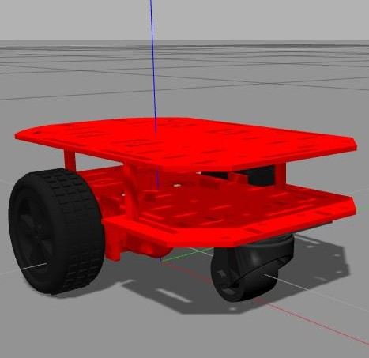

# My Robot Gazebo

Gazebo files to test the robot in the simulator.

### Build

Build package: 

```bash
$ catkin_make --only_pkg_with_deps my_robot_gazebo
$ source devel/setup.bash
```

Install dependencies: 

```bash
$ sudo apt-get install ros-noetic-ros-control
$ sudo apt-get install ros-noetic-controller-manager
$ sudo apt-get install ros-noetic-effort-controllers
```

### Test

Test the robot xacro:
```
$ roslaunch my_robot_gazebo my_robot_world.launch world:=empty paused:=true
```

Launch Gazebo & rviz simulations:
```
$ roslaunch my_robot_gazebo my_robot_world.launch
```

Move with the keyboard:
```
$ rosrun turtlebot3_teleop turtlebot3_teleop_key /cmd_vel:=/my_robot/cmd_vel
```


