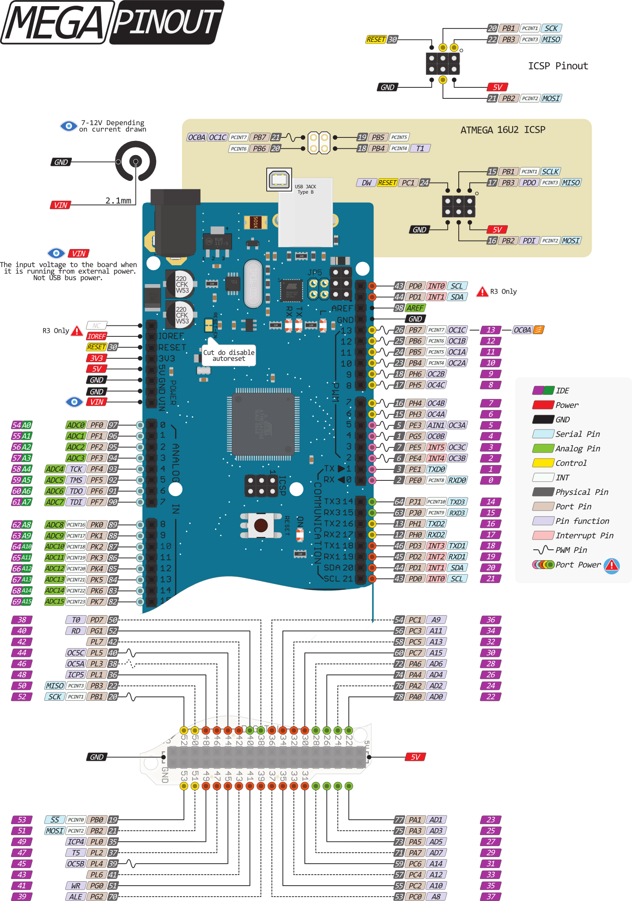

# Arduino code
===========================================

These are simple Arduino scripts to test the mobile robot hardware.

1) **AS5048-ros-node**: rosserial package for read data from two AS5048's magnetic encoder using Arduino MEGA2560, and publish to "_/encoder/left_" and "_/encoder/right_" topics.

2) **from_keyboard_node**: node that reads a _Twist_ message from the topic "_/cmd_vel_mux/input/teleop_" and moves the DC motors of the differential drive robot.

3) **from_keyboard_node_test**: lightweight implementation of the code _from_keyboard_node_. It uses local variables inside the class instead of global variables.

---

**Important package:** `arduino_peripherals`

Used by `ros_control` as `hardware_interface`.

- Upload the code into the Arduino
- Execute the node using:

```bash
$ roslaunch arduino_peripherals run_arduino_node.launch
```

---

## Hardware connection

This version of the robot consists of an Arduino MEGA2560 and two DC motors DAGU DG01D both with an AS5048A magnetic encoder attached to each motor shaft. For managing the control signals of the motors, it uses a L298N board.

The magnetic encoders use SPI wiring and share the same channel (`MOSI`,`MISO`,`SCK`). It's powered with 5V and the signals on the left correspond to Arduino pins on the right:

> `MOSI`: `D51`

> `MISO`: `D50`

> `SCK`: `D52`

> `CS`: `D6` (left wheel)
>     : `D7` (right wheel)


The motor driver has the following connection:

> `Button`: pressed for 5V motors

> `ENx`: connected to 5V through jumpers

> `IN1`: D11

> `IN1`: D10

> `IN1`: D9

> `IN1`: D8




