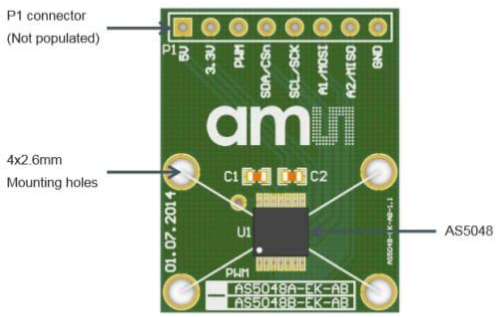
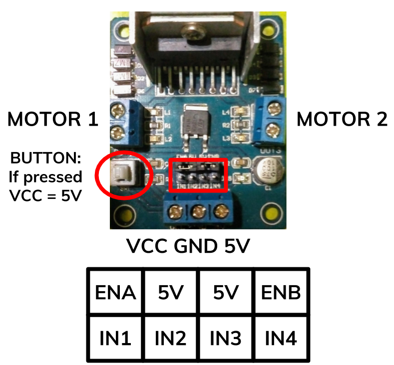
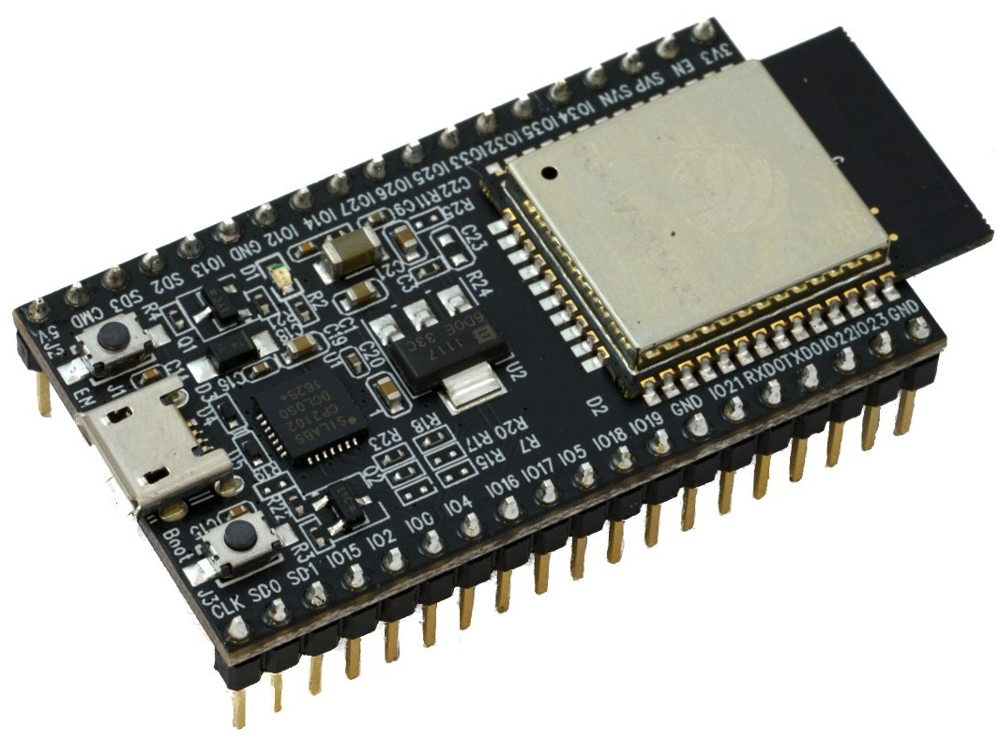
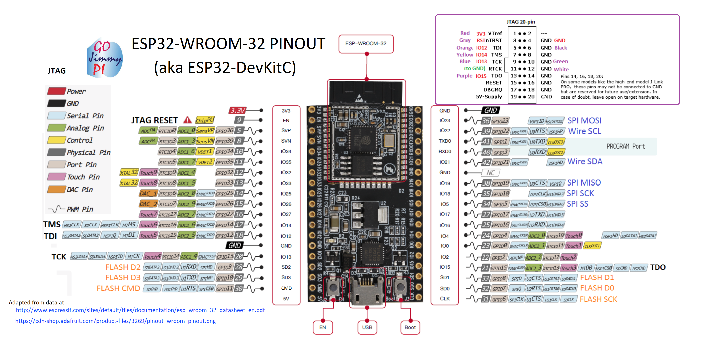

# ESP32 kit

## Installation

```bash
$ sudo usermod -a -G dialout $USER && \
sudo apt-get install git && \
wget https://bootstrap.pypa.io/get-pip.py && \
sudo python get-pip.py && \
sudo pip install pyserial && \
mkdir -p ~/Arduino/hardware/espressif && \
cd ~/Arduino/hardware/espressif && \
git clone https://github.com/espressif/arduino-esp32.git esp32 && \
cd esp32 && \
git submodule update --init --recursive && \
cd tools && \
python get.py
```

## Preparation

Create a file `user_data.h` in: `/esp32_scripts/esp32_peripherals/src/esp32_peripherals/include/` with the following structure as example:

```c++
#pragma once

static const char* ssid PROGMEM = "XXXX";
static const char* password PROGMEM = "XXXX";
static const uint8_t ip[] PROGMEM = {127, 0, 0, 1};
```

Don't forget to setup your network configuration and your ROS master IP.

## Execution

**NOTE:** Edit `esp32_peripherals.ino` with your own personal information!!

```bash
$ roslaunch esp32_peripherals run_esp32_node.launch
```

---

## Hardware connection

This version of the robot consists of an ESP32 dev kit and two DC motors DAGU DG01D both with an AS5048A magnetic encoder attached to each motor shaft. For managing the control signals of the motors, it uses a L298N board.

The magnetic encoders use SPI wiring and share the same channel (`MOSI`,`MISO`,`SCK`). It's powered with 5V and the signals on the left correspond to Arduino pins on the right:

> `MOSI`: `D23`

> `MISO`: `D19`

> `SCK`: `D18`

> `CS`: `D16` (left wheel)
>     : `D17` (right wheel)



The motor driver has the following connection:

> `Button`: pressed for 5V motors

> `ENx`: connected to 5V through jumpers

> `IN1`: D34

> `IN1`: D35

> `IN1`: D32

> `IN1`: D33






